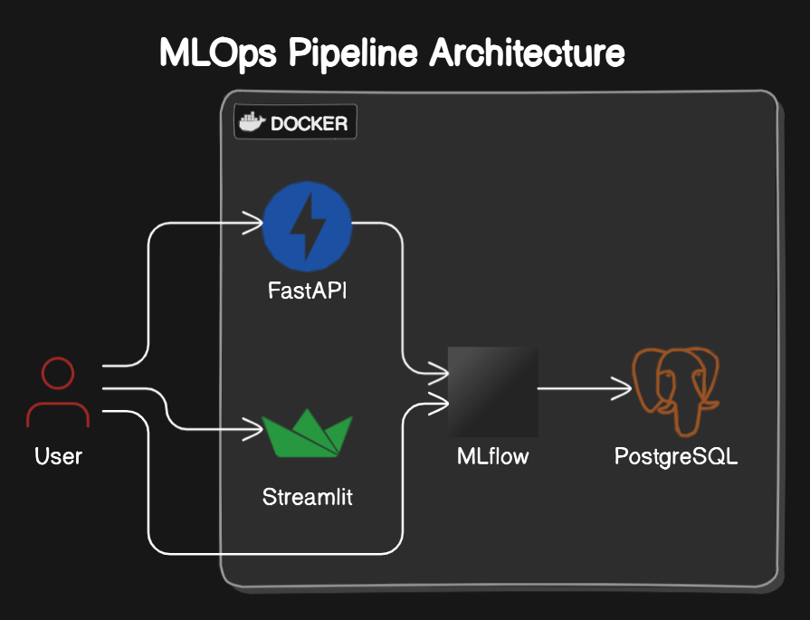

## MLOps Anomaly Detection Case

### Table of Contents

- [Introduction](#introduction)
- [Features](#features)
- [Project Structure](#project-structure)
- [Installation](#installation)
- [Usage](#usage)
- [Services](#services)

### Introduction

Welcome to the my case repository! This project demonstrates my humble understanding of Machine Learning Operations (MLOps) pipelines, integrating various tools and techniques to streamline the development, deployment, and monitoring of machine learning models.

I have really enjoyed learning about MLOps and I hope you find it acceptable.

### Features

- **Model Training**: Scripts and configurations to train machine learning models.
- **Model Deployment**: Tools and techniques to deploy models to production environments.
- **Monitoring and Logging**: Integrated logging and monitoring to ensure model performance and reliability.
- **CI/CD Integration**: Continuous Integration and Continuous Deployment setup for automated testing and deployment.

### Project Structure

```
.
├── data                    # Dataset and data processing scripts
├── docker                  # Docker images for backend and frontend
├── mlruns                  # MLflow runs for model training and deployment
├── models                  # Trained models as joblib files
├── notebooks               # Jupyter notebooks for experimentation and analysis
├── *.py                    # Project scripts
├── Makefile                # Makefile for CI/CD
├── compose.yaml            # Docker Compose configuration
├── README.md               # Project README file
└── requirements.txt        # Project dependencies
```

### Installation

To get started with this project, clone the repository and install the necessary dependencies.

```bash
git clone https://github.com/berkmonder/mlops-case.git
cd mlops-case
pip install -r requirements.txt # In a Python environment
```
#### Deploying the FastAPI, Streamlit, and Mlflow App 

Use `docker compose` to start the project and deploy the model.
```bash
docker compose up -d --build
```
or simply
```bash
make deploy
```
### Usage

For more detailed usage instructions, refer to the `Makefile`.
```bash
make help
```

### Services
This project uses Docker to manage and deploy various services that are essential for a complete MLOps pipeline. Here's a brief overview of each service and its role in the project:



#### FastAPI:
- url: localhost:8000
- Description: This service hosts a FastAPI application, which provides the main API endpoints for the project. It's used for serving the machine learning model's predictions, and retraining the model.

#### Streamlit
- url: localhost: 8501
- Description: This service runs a Streamlit application, which is used for creating interactive web applications and dashboards. In this project, it is used to visualize data, and provide a user-friendly interface for interacting with the predictions of machine learning models.

#### MLflow
- url: localhost:5000
- Description: MLflow is used to manage the machine learning lifecycle, including experimentation, reproducibility, and deployment. It tracks experiments, logs metrics, and stores model artifacts, providing a centralized platform for managing the entire ML workflow.

#### PostgreSQL
- Port: 5432
- Description: This service runs a PostgreSQL database,  which is suppossedly used to store and manage the data required by mlflow. The database should keep track of experiment metadata, results, and other relevant information, ensuring that all experiment details are persistently stored and easily retrievable. Although it currently is not used, I included it in the project for possibile future use.